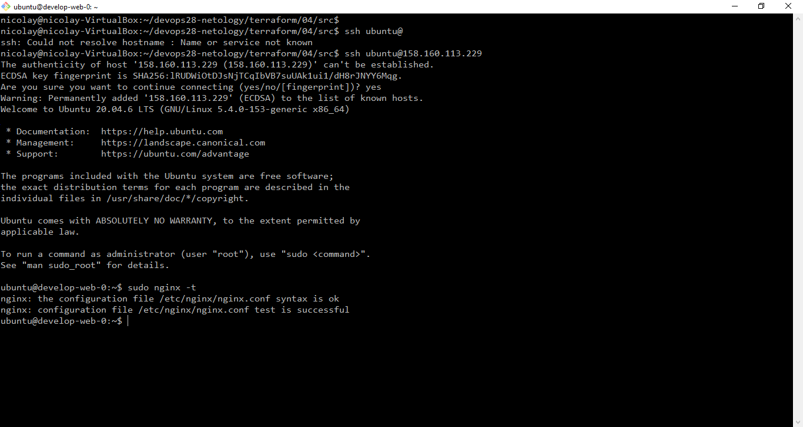

# Домашнее задание к занятию "Продвинутые методы работы с Terraform"

### Цель задания

1. Научиться использовать модули.
2. Отработать операции state.
3. Закрепить пройденный материал.


### Чеклист готовности к домашнему заданию

1. Зарегистрирован аккаунт в Yandex Cloud. Использован промокод на грант.
2. Установлен инструмент yandex CLI
3. Исходный код для выполнения задания расположен в директории [**04/src**](https://github.com/netology-code/ter-homeworks/tree/main/04/src).
4. Любые ВМ, использованные при выполнении задания должны быть прерываемыми, для экономии средств.

------

### Задание 1

1. Возьмите из [демонстрации к лекции готовый код](https://github.com/netology-code/ter-homeworks/tree/main/04/demonstration1) для создания ВМ с помощью remote модуля.
2. Создайте 1 ВМ, используя данный модуль. В файле cloud-init.yml необходимо использовать переменную для ssh ключа вместо хардкода. Передайте ssh-ключ в функцию template_file в блоке vars ={} .
Воспользуйтесь [**примером**](https://grantorchard.com/dynamic-cloudinit-content-with-terraform-file-templates/). Обратите внимание что ssh-authorized-keys принимает в себя список, а не строку!
3. Добавьте в файл cloud-init.yml установку nginx.
4. Предоставьте скриншот подключения к консоли и вывод команды ```sudo nginx -t```.
- **Ответ:**


------

### Задание 2

1. Напишите локальный модуль vpc, который будет создавать 2 ресурса: **одну** сеть и **одну** подсеть в зоне, объявленной при вызове модуля. например: ```ru-central1-a```.
2. Модуль должен возвращать значения vpc.id и subnet.id
3. Замените ресурсы yandex_vpc_network и yandex_vpc_subnet, созданным модулем.
4. Сгенерируйте документацию к модулю с помощью terraform-docs.    
 
Пример вызова:
```
module "vpc_dev" {
  source       = "./vpc"
  env_name     = "develop"
  zone = "ru-central1-a"
  cidr = "10.0.1.0/24"
}
```

### Задание 3
1. Выведите список ресурсов в стейте.
- **Ответ:**
```Bash
nicolay@nicolay-VirtualBox:~/devops28-netology/terraform/04/src$ terraform show
# data.template_file.cloudinit:
data "template_file" "cloudinit" {
    id       = "fbdfbc67f1f3d578525b5c4244cff9cc5b3cbd8b8d2bcf58a4e5c1ea68f183ad"
    rendered = <<-EOT
        #cloud-config
        users:
          - name: ubuntu
            groups: sudo
            shell: /bin/bash
            sudo: ['ALL=(ALL) NOPASSWD:ALL']
            ssh_authorized_keys:
              - ssh-ed25519 AAAAC3NzaC1lZDI1NTE5AAAAIK7LDD/Df/YYEDcZPQfzkvrUsbbG3Vbm1SrSKKSTTjDl nicolay@nicolay-VirtualBox

        package_update: true
        package_upgrade: false
        packages:
         - vim
         - nginx
    EOT
    template = <<-EOT
        #cloud-config
        users:
          - name: ubuntu
            groups: sudo
            shell: /bin/bash
            sudo: ['ALL=(ALL) NOPASSWD:ALL']
            ssh_authorized_keys:
              - ${public_key}
        package_update: true
        package_upgrade: false
        packages:
         - vim
         - nginx
    EOT
    vars     = {
        "public_key" = <<-EOT
            ssh-ed25519 AAAAC3NzaC1lZDI1NTE5AAAAIK7LDD/Df/YYEDcZPQfzkvrUsbbG3Vbm1SrSKKSTTjDl nicolay@nicolay-VirtualBox
        EOT
    }
}

# module.test-vm.data.yandex_compute_image.my_image:
data "yandex_compute_image" "my_image" {
    created_at    = "2023-07-10T10:52:32Z"
    description   = "ubuntu 20.04 lts"
    family        = "ubuntu-2004-lts"
    folder_id     = "standard-images"
    id            = "fd85f37uh98ldl1omk30"
    image_id      = "fd85f37uh98ldl1omk30"
    labels        = {}
    min_disk_size = 5
    name          = "ubuntu-20-04-lts-v20230710"
    os_type       = "linux"
    pooled        = true
    product_ids   = [
        "f2ef6jide8f1cj8dcbun",
    ]
    size          = 4
    status        = "ready"
}

# module.test-vm.yandex_compute_instance.vm[0]:
resource "yandex_compute_instance" "vm" {
    allow_stopping_for_update = true
    created_at                = "2023-07-21T19:31:29Z"
    description               = "TODO: description; {{terraform managed}}"
    folder_id                 = "b1g65udbfo9s663p3amb"
    fqdn                      = "develop-web-0.ru-central1.internal"
    hostname                  = "develop-web-0"
    id                        = "fhmkm8steodhgobbsh4o"
    labels                    = {
        "env"     = "develop"
        "project" = "undefined"
    }
    metadata                  = {
        "serial-port-enable" = "1"
        "user-data"          = <<-EOT
            #cloud-config
            users:
              - name: ubuntu
                groups: sudo
                shell: /bin/bash
                sudo: ['ALL=(ALL) NOPASSWD:ALL']
                ssh_authorized_keys:
                  - ssh-ed25519 AAAAC3NzaC1lZDI1NTE5AAAAIK7LDD/Df/YYEDcZPQfzkvrUsbbG3Vbm1SrSKKSTTjDl nicolay@nicolay-VirtualBox

            package_update: true
            package_upgrade: false
            packages:
             - vim
             - nginx
        EOT
    }
    name                      = "develop-web-0"
    network_acceleration_type = "standard"
    platform_id               = "standard-v1"
    status                    = "running"
    zone                      = "ru-central1-a"

    boot_disk {
        auto_delete = true
        device_name = "fhm7b4nc8fhkeabbv184"
        disk_id     = "fhm7b4nc8fhkeabbv184"
        mode        = "READ_WRITE"

        initialize_params {
            block_size = 4096
            image_id   = "fd85f37uh98ldl1omk30"
            size       = 10
            type       = "network-hdd"
        }
    }

    metadata_options {
        aws_v1_http_endpoint = 1
        aws_v1_http_token    = 2
        gce_http_endpoint    = 1
        gce_http_token       = 1
    }

    network_interface {
        index              = 0
        ip_address         = "10.0.5.14"
        ipv4               = true
        ipv6               = false
        mac_address        = "d0:0d:14:b2:39:d7"
        nat                = true
        nat_ip_address     = "158.160.42.110"
        nat_ip_version     = "IPV4"
        security_group_ids = []
        subnet_id          = "e9bbnbomi83alp016e7q"
    }

    placement_policy {
        host_affinity_rules = []
    }

    resources {
        core_fraction = 5
        cores         = 2
        gpus          = 0
        memory        = 1
    }

    scheduling_policy {
        preemptible = true
    }
}


# module.vpc.yandex_vpc_network.test:
resource "yandex_vpc_network" "test" {
    created_at = "2023-07-21T19:31:25Z"
    folder_id  = "b1g65udbfo9s663p3amb"
    id         = "enphj5iqu6c5dvj9tq2m"
    labels     = {}
    name       = "vpc"
    subnet_ids = []
}

# module.vpc.yandex_vpc_subnet.test:
resource "yandex_vpc_subnet" "test" {
    created_at     = "2023-07-21T19:31:26Z"
    folder_id      = "b1g65udbfo9s663p3amb"
    id             = "e9bbnbomi83alp016e7q"
    labels         = {}
    name           = "develop-ru-central1-a"
    network_id     = "enphj5iqu6c5dvj9tq2m"
    v4_cidr_blocks = [
        "10.0.5.0/24",
    ]
    v6_cidr_blocks = []
    zone           = "ru-central1-a"
}

Outputs:

vpc = {
    name = {
        created_at     = "2023-07-21T19:31:26Z"
        description    = ""
        dhcp_options   = []
        folder_id      = "b1g65udbfo9s663p3amb"
        id             = "e9bbnbomi83alp016e7q"
        labels         = {}
        name           = "develop-ru-central1-a"
        network_id     = "enphj5iqu6c5dvj9tq2m"
        route_table_id = ""
        v4_cidr_blocks = [
            "10.0.5.0/24",
        ]
        v6_cidr_blocks = []
        zone           = "ru-central1-a"
    }
}
```
2. Полностью удалите из стейта модуль vpc.
- **Ответ:**
```Bash
nicolay@nicolay-VirtualBox:~/devops28-netology/terraform/04/src$ terraform state rm "module.vpc"
Removed module.vpc.yandex_vpc_network.test
Removed module.vpc.yandex_vpc_subnet.test
Successfully removed 2 resource instance(s).
```
3. Полностью удалите из стейта модуль vm.
- **Ответ:**
```Bash
nicolay@nicolay-VirtualBox:~/devops28-netology/terraform/04/src$ terraform state rm "module.test-vm"
Removed module.test-vm.data.yandex_compute_image.my_image
Removed module.test-vm.yandex_compute_instance.vm[0]
Successfully removed 2 resource instance(s).
```
4. Импортируйте все обратно. Проверьте terraform plan - изменений быть не должно.
Приложите список выполненных команд и скриншоты процессы.
- **Ответ:**
```Bash
nicolay@nicolay-VirtualBox:~/devops28-netology/terraform/04/src$ terraform import "module.vpc.yandex_vpc_network.test" enphj5iqu6c5dvj9tq2m
╷
│ Warning: Version constraints inside provider configuration blocks are deprecated
│
│   on .terraform/modules/test-vm/providers.tf line 2, in provider "template":
│    2:   version = "2.2.0"
│
│ Terraform 0.13 and earlier allowed provider version constraints inside the provider configuration block, but that is now deprecated and will be
│ removed in a future version of Terraform. To silence this warning, move the provider version constraint into the required_providers block.
╵

data.template_file.cloudinit: Reading...
data.template_file.cloudinit: Read complete after 0s [id=fbdfbc67f1f3d578525b5c4244cff9cc5b3cbd8b8d2bcf58a4e5c1ea68f183ad]
module.test-vm.data.yandex_compute_image.my_image: Reading...
module.vpc.yandex_vpc_network.test: Importing from ID "enphj5iqu6c5dvj9tq2m"...
module.vpc.yandex_vpc_network.test: Import prepared!
  Prepared yandex_vpc_network for import
module.vpc.yandex_vpc_network.test: Refreshing state... [id=enphj5iqu6c5dvj9tq2m]
module.test-vm.data.yandex_compute_image.my_image: Read complete after 1s [id=fd85f37uh98ldl1omk30]

Import successful!

The resources that were imported are shown above. These resources are now in
your Terraform state and will henceforth be managed by Terraform.
```
```Bash
nicolay@nicolay-VirtualBox:~/devops28-netology/terraform/04/src$ terraform import "module.vpc.yandex_vpc_subnet.test" e9bbnbomi83alp016e7q
╷
│ Warning: Version constraints inside provider configuration blocks are deprecated
│
│   on .terraform/modules/test-vm/providers.tf line 2, in provider "template":
│    2:   version = "2.2.0"
│
│ Terraform 0.13 and earlier allowed provider version constraints inside the provider configuration block, but that is now deprecated and will be
│ removed in a future version of Terraform. To silence this warning, move the provider version constraint into the required_providers block.
╵

data.template_file.cloudinit: Reading...
data.template_file.cloudinit: Read complete after 0s [id=fbdfbc67f1f3d578525b5c4244cff9cc5b3cbd8b8d2bcf58a4e5c1ea68f183ad]
module.test-vm.data.yandex_compute_image.my_image: Reading...
module.vpc.yandex_vpc_subnet.test: Importing from ID "e9bbnbomi83alp016e7q"...
module.vpc.yandex_vpc_subnet.test: Import prepared!
  Prepared yandex_vpc_subnet for import
module.vpc.yandex_vpc_subnet.test: Refreshing state... [id=e9bbnbomi83alp016e7q]
module.test-vm.data.yandex_compute_image.my_image: Read complete after 1s [id=fd85f37uh98ldl1omk30]

Import successful!

The resources that were imported are shown above. These resources are now in
your Terraform state and will henceforth be managed by Terraform.
```
```Bash
nicolay@nicolay-VirtualBox:~/devops28-netology/terraform/04/src$ terraform import "module.test-vm.yandex_compute_instance.vm[0]" fhmkm8steodhgobbsh4o
╷
│ Warning: Version constraints inside provider configuration blocks are deprecated
│
│   on .terraform/modules/test-vm/providers.tf line 2, in provider "template":
│    2:   version = "2.2.0"
│
│ Terraform 0.13 and earlier allowed provider version constraints inside the provider configuration block, but that is now deprecated and will be
│ removed in a future version of Terraform. To silence this warning, move the provider version constraint into the required_providers block.
╵

module.test-vm.data.yandex_compute_image.my_image: Reading...
data.template_file.cloudinit: Reading...
data.template_file.cloudinit: Read complete after 0s [id=fbdfbc67f1f3d578525b5c4244cff9cc5b3cbd8b8d2bcf58a4e5c1ea68f183ad]
module.test-vm.data.yandex_compute_image.my_image: Read complete after 1s [id=fd85f37uh98ldl1omk30]
module.test-vm.yandex_compute_instance.vm[0]: Importing from ID "fhmkm8steodhgobbsh4o"...
module.test-vm.yandex_compute_instance.vm[0]: Import prepared!
  Prepared yandex_compute_instance for import
module.test-vm.yandex_compute_instance.vm[0]: Refreshing state... [id=fhmkm8steodhgobbsh4o]

Import successful!

The resources that were imported are shown above. These resources are now in
your Terraform state and will henceforth be managed by Terraform.
```
## Дополнительные задания (со звездочкой*)

**Настоятельно рекомендуем выполнять все задания под звёздочкой.**   Их выполнение поможет глубже разобраться в материале.   
Задания под звёздочкой дополнительные (необязательные к выполнению) и никак не повлияют на получение вами зачета по этому домашнему заданию. 


### Задание 4*

1. Измените модуль vpc так, чтобы он мог создать подсети во всех зонах доступности, переданных в переменной типа list(object) при вызове модуля.  
  
Пример вызова:
```
module "vpc_prod" {
  source       = "./vpc"
  env_name     = "production"
  subnets = [
    { zone = "ru-central1-a", cidr = "10.0.1.0/24" },
    { zone = "ru-central1-b", cidr = "10.0.2.0/24" },
    { zone = "ru-central1-c", cidr = "10.0.3.0/24" },
  ]
}

module "vpc_dev" {
  source       = "./vpc"
  env_name     = "develop"
  subnets = [
    { zone = "ru-central1-a", cidr = "10.0.1.0/24" },
  ]
}
```

Предоставьте код, план выполнения, результат из консоли YC.

### Задание 5***

1. Напишите модуль для создания кластера managed БД Mysql в Yandex Cloud с 1 или 3 хостами в зависимости от переменной HA=true или HA=false. Используйте ресурс yandex_mdb_mysql_cluster (передайте имя кластера и id сети).
2. Напишите модуль для создания базы данных и пользователя в уже существующем кластере managed БД Mysql. Используйте ресурсы yandex_mdb_mysql_database и yandex_mdb_mysql_user (передайте имя базы данных, имя пользователя и id кластера при вызове модуля).
3. Используя оба модуля, создайте кластер example из одного хоста, а затем добавьте в него БД test и пользователя app. Затем измените переменную и превратите сингл хост в кластер из 2х серверов.
4. 
Предоставьте план выполнения и по-возможности результат. Сразу же удаляйте созданные ресурсы, так как кластер может стоить очень дорого! Используйте минимальную конфигурацию.

### Задание 6*

1. Разверните у себя локально vault, используя docker-compose.yml в проекте.
2. Для входа в web интерфейс и авторизации terraform в vault используйте токен "education"
3. Создайте новый секрет по пути http://127.0.0.1:8200/ui/vault/secrets/secret/create  
Path: example  
secret data key: test 
secret data value: congrats!  
4. Считайте данный секрет с помощью terraform и выведите его в output по примеру:
```
provider "vault" {
 address = "http://<IP_ADDRESS>:<PORT_NUMBER>"
 skip_tls_verify = true
 token = "education"
}
data "vault_generic_secret" "vault_example"{
 path = "secret/example"
}

output "vault_example" {
 value = "${nonsensitive(data.vault_generic_secret.vault_example.data)}"
} 

можно обратится не к словарю, а конкретному ключу.
terraform console: >nonsensitive(data.vault_generic_secret.vault_example.data.<имя ключа в секрете>)
```
5. Попробуйте самостоятельно разобраться в документации и записать новый секрет в vault с помощью terraform. 


### Правила приема работы

В своём git-репозитории создайте новую ветку terraform-04, закомитьте в эту ветку свой финальный код проекта. Ответы на задания и необходимые скриншоты оформите в md-файле в ветке terraform-04.

В качестве результата прикрепите ссылку на ветку terraform-04 в вашем репозитории.

**ВАЖНО!** Удалите все созданные ресурсы.

### Критерии оценки

Зачёт:

* выполнены все задания;
* ответы даны в развёрнутой форме;
* приложены соответствующие скриншоты и файлы проекта;
* в выполненных заданиях нет противоречий и нарушения логики.

На доработку:

* задание выполнено частично или не выполнено вообще;
* в логике выполнения заданий есть противоречия и существенные недостатки. 


