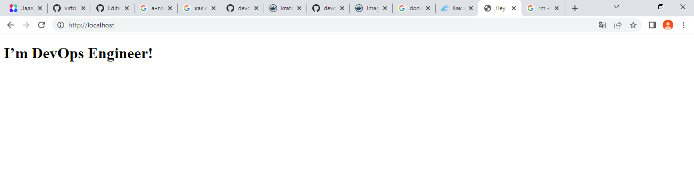

# Домашнее задание к занятию 3. «Введение. Экосистема. Архитектура. Жизненный цикл Docker-контейнера»

## Как сдавать задания

Обязательны к выполнению задачи без звёздочки. Их нужно выполнить, чтобы получить зачёт и диплом о профессиональной переподготовке.

Задачи со звёздочкой (*) — дополнительные задачи и/или задачи повышенной сложности. Их выполнять не обязательно, но они помогут вам глубже понять тему.

Домашнее задание выполните в файле readme.md в GitHub-репозитории. В личном кабинете отправьте на проверку ссылку на .md-файл в вашем репозитории.

Любые вопросы по решению задач задавайте в чате учебной группы.

---


## Важно

Перед отправкой работы на проверку удаляйте неиспользуемые ресурсы.
Это нужно, чтобы не расходовать средства, полученные в результате использования промокода.

Подробные рекомендации [здесь](https://github.com/netology-code/virt-homeworks/blob/virt-11/r/README.md).

---

## Задача 1

Сценарий выполнения задачи:

- создайте свой репозиторий на https://hub.docker.com;
- выберите любой образ, который содержит веб-сервер Nginx;
- создайте свой fork образа;
- реализуйте функциональность:
запуск веб-сервера в фоне с индекс-страницей, содержащей HTML-код ниже:
```
<html>
<head>
Hey, Netology
</head>
<body>
<h1>I’m DevOps Engineer!</h1>
</body>
</html>
```

Опубликуйте созданный fork в своём репозитории и предоставьте ответ в виде ссылки на https://hub.docker.com/username_repo.

Ответ:
https://hub.docker.com/repository/docker/kratomm/nginx-docker




## Задача 2

Посмотрите на сценарий ниже и ответьте на вопрос:
«Подходит ли в этом сценарии использование Docker-контейнеров или лучше подойдёт виртуальная машина, физическая машина? Может быть, возможны разные варианты?»

Детально опишите и обоснуйте свой выбор.

--

Сценарий:

- высоконагруженное монолитное Java веб-приложение;
- Nodejs веб-приложение;
- мобильное приложение c версиями для Android и iOS;
- шина данных на базе Apache Kafka;
- Elasticsearch-кластер для реализации логирования продуктивного веб-приложения — три ноды elasticsearch, два logstash и две ноды kibana;
- мониторинг-стек на базе Prometheus и Grafana;
- MongoDB как основное хранилище данных для Java-приложения;
- Gitlab-сервер для реализации CI/CD-процессов и приватный (закрытый) Docker Registry.

Ответ:
- Высоконагруженное монолитное java веб-приложение - монолитное веб-приложение предполагает сборку всего в одном месте (frontend, backend, UI). Так как монолитное веб-приложение высоконагруженное, то стоит размещать или на физической среде, или можно использовать пара виртуализацию, если накладными расходами можно пренебречь, однако контейнеризация не подойдет, так предполагается выполнение одного сервиса в рамках контейнера. 
- Nodejs веб-приложение - контейнеризация подойдет для решения задачи, по сути node.js - это условно говоря environment для javascript для построения логики работы веб-приложения, является его частью, модулем, хорошо укладывается в микро сервисную архитектуру.
- Мобильное приложение c версиями для Android и iOS - предполагается, что приложение имеет своего потребителя, а значит необходим UI для взаимодействия с пользователем. По моему мнению, корректнее всего использовать виртуализацию с реализацией виртуальной машины.
- Шина данных на базе Apache Kafka - если можно так выразится, то это сервис по трансляции данных из одного формата данных одного приложения в другое. По моему мнению хорошо применить контейнеризацию, так как отсутствуют накладные расходы на виртуализацию, достигается простота масштабирования и управления. В данном случае необходимо организация отказоустойчивости.
- Elasticsearch кластер для реализации логирования продуктивного веб-приложения - три ноды elasticsearch, два logstash и две ноды kibana - для упомянутых продуктов есть контейнеры на docker hub. Из-за простоты управления и сборки контейнеров, мне кажется необходимо распихать продукты по контейнерам и на основании контейнеров собрать кластер стека ELK. В силу прозрачности реализации, в том числе возможности реализации подходов IaaC, контейнеризация в данном случае помогает закрыть вопросы по менеджменту и что очень важно получить регулярный предсказуемый результат. 
- Мониторинг-стек на базе Prometheus и Grafana - по моему мнению также как и пример с ELK, скорее всего с течением времени будут вноситься изменения в систему мониторинга и не один раз, будут добавляется метрики, так как точки мониторинга будут меняться - добавляться новый функционал, было бы не плохо применить IaaC в том числе и в этом случае - мониторинг как код, контейнеризация помогает этого добиться.
- MongoDB, как основное хранилище данных для java-приложения - либо виртуализация, либо контейнеризация, все зависит от реализации архитектуры приложения. Сложно дать вразумительный ответ - никогда не работал с данной БД, затрудняюсь обосновать выбор. Чувствую, что так будет правильно.
- Gitlab сервер для реализации CI/CD процессов и приватный (закрытый) Docker Registry - отдельный физический сервер или виртуализация, если сервер есть в наличии использовал бы его, но только необходимо оценить доступные объемы хранения данных, в том числе подумать о техническом сопровождении: просчитать затраты на поддержку железа и ЗИП. Если по совокупности поставленных задач будет понятно, что через осязаемое недалекое время мы выйдем за пределы мощностей физ. сервера, то выбрал бы, на перспективу, виртуализацию, однако возможны первичные затраты на доп. железо, но все зависит от проекта. Требуется пред проектная аналитика.

## Задача 3

- Запустите первый контейнер из образа ***centos*** c любым тегом в фоновом режиме, подключив папку ```/data``` из текущей рабочей директории на хостовой машине в ```/data``` контейнера.
- Запустите второй контейнер из образа ***debian*** в фоновом режиме, подключив папку ```/data``` из текущей рабочей директории на хостовой машине в ```/data``` контейнера.
- Подключитесь к первому контейнеру с помощью ```docker exec``` и создайте текстовый файл любого содержания в ```/data```.
- Добавьте ещё один файл в папку ```/data``` на хостовой машине.
- Подключитесь во второй контейнер и отобразите листинг и содержание файлов в ```/data``` контейнера.

Ответ:
Создаю контейнер с centos
```
PS E:\ПРОЕКТЫ\DevOps\Обучение devops\DZ> docker run -itd -v /data:/data centos
Unable to find image 'centos:latest' locally
latest: Pulling from library/centos
a1d0c7532777: Pull complete
Digest: sha256:a27fd8080b517143cbbbab9dfb7c8571c40d67d534bbdee55bd6c473f432b177
Status: Downloaded newer image for centos:latest
e9a1dbb7a3a6ba856cfb3450adf69d4be8b8b9ef7a9cd0d4aae3d0986fe595e0
PS E:\ПРОЕКТЫ\DevOps\Обучение devops\DZ>
PS E:\ПРОЕКТЫ\DevOps\Обучение devops\DZ> docker ps
CONTAINER ID   IMAGE                 COMMAND                  CREATED              STATUS              PORTS                NAMES
e9a1dbb7a3a6   centos                "/bin/bash"              About a minute ago   Up About a minute                        flamboyant_meninsky
PS E:\ПРОЕКТЫ\DevOps\Обучение devops\DZ> docker exec -it e9a1dbb7a3a6 bin/bash
[root@e9a1dbb7a3a6 /]#
[root@e9a1dbb7a3a6 /]#
[root@e9a1dbb7a3a6 /]#
[root@e9a1dbb7a3a6 /]#
[root@e9a1dbb7a3a6 /]# ls -lah
total 56K
drwxr-xr-x   1 root root 4.0K May 18 10:44 .
drwxr-xr-x   1 root root 4.0K May 18 10:44 ..
-rwxr-xr-x   1 root root    0 May 18 10:44 .dockerenv
lrwxrwxrwx   1 root root    7 Nov  3  2020 bin -> usr/bin
drwxr-xr-x   2 root root   40 May 18 10:44 data
drwxr-xr-x   5 root root  360 May 18 10:44 dev
drwxr-xr-x   1 root root 4.0K May 18 10:44 etc
drwxr-xr-x   2 root root 4.0K Nov  3  2020 home
lrwxrwxrwx   1 root root    7 Nov  3  2020 lib -> usr/lib
lrwxrwxrwx   1 root root    9 Nov  3  2020 lib64 -> usr/lib64
drwx------   2 root root 4.0K Sep 15  2021 lost+found
drwxr-xr-x   2 root root 4.0K Nov  3  2020 media
drwxr-xr-x   2 root root 4.0K Nov  3  2020 mnt
drwxr-xr-x   2 root root 4.0K Nov  3  2020 opt
dr-xr-xr-x 260 root root    0 May 18 10:44 proc
dr-xr-x---   2 root root 4.0K Sep 15  2021 root
drwxr-xr-x  11 root root 4.0K Sep 15  2021 run
lrwxrwxrwx   1 root root    8 Nov  3  2020 sbin -> usr/sbin
drwxr-xr-x   2 root root 4.0K Nov  3  2020 srv
dr-xr-xr-x  13 root root    0 May 18 10:44 sys
drwxrwxrwt   7 root root 4.0K Sep 15  2021 tmp
drwxr-xr-x  12 root root 4.0K Sep 15  2021 usr
drwxr-xr-x  20 root root 4.0K Sep 15  2021 var
[root@e9a1dbb7a3a6 /]#
```
Аналогичные действия для контейнера с debian

```

```
## Задача 4 (*)

Воспроизведите практическую часть лекции самостоятельно.

Соберите Docker-образ с Ansible, загрузите на Docker Hub и пришлите ссылку вместе с остальными ответами к задачам.


---

### Как cдавать задание

Выполненное домашнее задание пришлите ссылкой на .md-файл в вашем репозитории.
