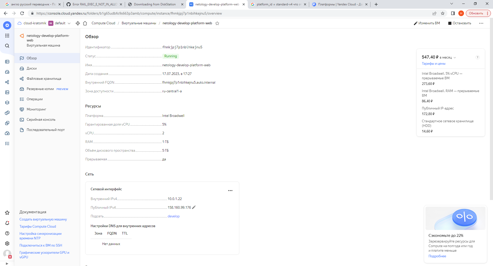
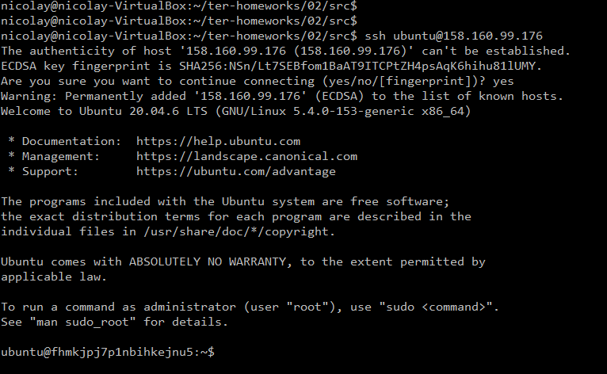

# Домашнее задание к занятию «Основы Terraform. Yandex Cloud»

### Цель задания

1. Создать свои ресурсы в облаке Yandex Cloud с помощью Terraform.
2. Освоить работу с переменными Terraform.


### Чеклист готовности к домашнему заданию

1. Зарегистрирован аккаунт в Yandex Cloud. Использован промокод на грант.
2. Установлен инструмент Yandex Cli.
3. Исходный код для выполнения задания расположен в директории [**02/src**](https://github.com/netology-code/ter-homeworks/tree/main/02/src).


### Задание 0

1. Ознакомьтесь с [документацией к security-groups в Yandex Cloud](https://cloud.yandex.ru/docs/vpc/concepts/security-groups?from=int-console-help-center-or-nav).
2. Запросите preview доступ к данному функционалу в ЛК Yandex Cloud. Обычно его выдают в течении 24-х часов.
https://console.cloud.yandex.ru/folders/<ваш cloud_id>/vpc/security-groups.   
Этот функционал понадобится к следующей лекции. 


### Задание 1
В качестве ответа всегда полностью прикладываете ваш terraform-код в git!

1. Изучите проект. В файле variables.tf объявлены переменные для yandex provider.
2. Переименуйте файл personal.auto.tfvars_example в personal.auto.tfvars. Заполните переменные (идентификаторы облака, токен доступа). Благодаря .gitignore этот файл не попадет в публичный репозиторий. **Вы можете выбрать иной способ безопасно передать секретные данные в terraform.**
3. Сгенерируйте или используйте свой текущий ssh ключ. Запишите его открытую часть в переменную **vms_ssh_root_key**.
4. Инициализируйте проект, выполните код. Исправьте намеренное допущенные ошибки. Ответьте в чем заключается их суть?

**Ответ:**
- Первая ошибка с которой я столкнулся является выбором платформы для виртуальной машины. В файле **main.tf, platform_id = "standart-v4"** - данной платформы не существует в YC, о чем свидетельствует ошибка ниже. Поэтому данную ошибку исправил на **platform_id = "standard-v1"**
```Bash
Error: Error while requesting API to create instance: server-request-id = eded20e0-b3dc-4e67-a4bd-3c18119a1746 server-trace-id = 4bec36205e9578b:acfc731602d6358:4bec36205e9578b:1 client-request-id = d8251740-64b2-4cd7-8161-fbe5de2a3f81 client-trace-id = 7f93740c-a6b6-4787-b036-539ddc9bd7f4 rpc error: code = FailedPrecondition desc = Platform "standart-v4" not found
│
│   with yandex_compute_instance.platform,
│   on main.tf line 15, in resource "yandex_compute_instance" "platform":
│   15: resource "yandex_compute_instance" "platform" {
```
- Вторая ошибка с которой я столкнулся заключается в неверном указании количестве ядер, о чем свидетельствует ошибка ниже. В данной платформе что я выбрал выше, допустимое колчество ядер min=2, max=32. В файле **main.tf** параметр **cores = 1**, меняем данное значение на **cores = 2**
```Bash
Error: Error while requesting API to create instance: server-request-id = dc1c6455-2905-44f6-97bc-7fac497cb236 server-trace-id = a66a63d217aa6e24:714ed4cd2fef2b81:a66a63d217aa6e24:1 client-request-id = 1cb22296-3f6a-4418-85a1-8b070e2f93a4 client-trace-id = 65d96f20-8741-468a-94c8-91c8111662a6 rpc error: code = InvalidArgument desc = the specified number of cores is not available on platform "standard-v1"; allowed core number: 2, 4
│
│   with yandex_compute_instance.platform,
│   on main.tf line 15, in resource "yandex_compute_instance" "platform":
│   15: resource "yandex_compute_instance" "platform" {
```
5. Ответьте, как в процессе обучения могут пригодиться параметры```preemptible = true``` и ```core_fraction=5``` в параметрах ВМ? Ответ в документации Yandex cloud.

**Ответ:**
- Параметр **preemptible = true** означает прерываемая виртуальная машина.
  Прерываемые виртуальные машины — это виртуальные машины, которые могут быть принудительно остановлены в любой момент. Это может произойти в двух случаях:
  Если с момента запуска виртуальной машины прошло 24 часа.
  Если возникнет нехватка ресурсов для запуска обычной виртуальной машины в той же зоне доступности. Вероятность такого события низкая, но может меняться изо дня в день.
  Прерываемые виртуальные машины доступны по более низкой цене в сравнении с обычными, однако не обеспечивают отказоустойчивости. Если сказать простыми словами она дешёвая и влюбое время можно её выключить.
- Параметр **core_fraction=5** означает базовый уровень производительности каждого ядра CPU у создаваемых инстансов. Данный параметр ограничивает каждое ядро работать на 5% не выше. Значит виртуальная машина 
  также будет стоить не дорого.

В качестве решения приложите:
- скриншот ЛК Yandex Cloud с созданной ВМ,

- скриншот успешного подключения к консоли ВМ через ssh(к OS ubuntu необходимо подключаться под пользователем ubuntu: "ssh ubuntu@vm_ip_address"),

- ответы на вопросы.

### Задание 2

1. Изучите файлы проекта.
2. Замените все "хардкод" **значения** для ресурсов **yandex_compute_image** и **yandex_compute_instance** на **отдельные** переменные. К названиям переменных ВМ добавьте в начало префикс **vm_web_** .  Пример: **vm_web_name**.
2. Объявите нужные переменные в файле variables.tf, обязательно указывайте тип переменной. Заполните их **default** прежними значениями из main.tf. 
3. Проверьте terraform plan (изменений быть не должно). 

**Ответ:**
```Bash
data "yandex_compute_image" "ubuntu" {
  family = var.vm_web_family
}
resource "yandex_compute_instance" "platform" {
  name        = var.vm_web_name
  platform_id = var.vm_web_platform_id
  resources {
    cores         = var.vm_veb_cores
    memory        = var.vm_veb_memory
    core_fraction = var.vm_veb_core_fraction
  }
```
```Bash
nicolay@nicolay-VirtualBox:~/ter-homeworks/02/src$
nicolay@nicolay-VirtualBox:~/ter-homeworks/02/src$ terraform plan
data.yandex_compute_image.ubuntu: Reading...
yandex_vpc_network.develop: Refreshing state... [id=enpuqtagudah1ufl4q54]
data.yandex_compute_image.ubuntu: Read complete after 1s [id=fd85f37uh98ldl1omk30]
yandex_vpc_subnet.develop: Refreshing state... [id=e9b3kuqst5363mhu677p]
yandex_compute_instance.platform: Refreshing state... [id=fhmkjpj7p1nbihkejnu5]

No changes. Your infrastructure matches the configuration.

Terraform has compared your real infrastructure against your configuration and found no differences, so no changes are needed.
nicolay@nicolay-VirtualBox:~/ter-homeworks/02/src$
```
### Задание 3

1. Создайте в корне проекта файл 'vms_platform.tf' . Перенесите в него все переменные первой ВМ.
2. Скопируйте блок ресурса и создайте с его помощью вторую ВМ(в файле main.tf): **"netology-develop-platform-db"** ,  cores  = 2, memory = 2, core_fraction = 20. Объявите ее переменные с префиксом **vm_db_** в том же файле('vms_platform.tf').
3. Примените изменения.

**Ответ:**
```Bash
nicolay@nicolay-VirtualBox:~/ter-homeworks/02/src$ terraform apply
data.yandex_compute_image.ubuntu: Reading...
data.yandex_compute_image.ubuntu: Read complete after 1s [id=fd85f37uh98ldl1omk30]

Terraform used the selected providers to generate the following execution plan. Resource actions are indicated with the following symbols:
  + create

Terraform will perform the following actions:

  # yandex_compute_instance.test will be created
  + resource "yandex_compute_instance" "test" {
      + created_at                = (known after apply)
      + folder_id                 = (known after apply)
      + fqdn                      = (known after apply)
      + gpu_cluster_id            = (known after apply)
      + hostname                  = (known after apply)
      + id                        = (known after apply)
      + metadata                  = {
          + "serial-port-enable" = "1"
          + "ssh-keys"           = "ubuntu:ssh-ed25519 AAAAC3NzaC1lZDI1NTE5AAAAIK7LDD/Df/YYEDcZPQfzkvrUsbbG3Vbm1SrSKKSTTjDl nicolay@nicolay-VirtualBox"
        }
      + name                      = "netology-develop-platform-db"
      + network_acceleration_type = "standard"
      + platform_id               = "standard-v1"
      + service_account_id        = (known after apply)
      + status                    = (known after apply)
      + zone                      = (known after apply)

      + boot_disk {
          + auto_delete = true
          + device_name = (known after apply)
          + disk_id     = (known after apply)
          + mode        = (known after apply)

          + initialize_params {
              + block_size  = (known after apply)
              + description = (known after apply)
              + image_id    = "fd85f37uh98ldl1omk30"
              + name        = (known after apply)
              + size        = (known after apply)
              + snapshot_id = (known after apply)
              + type        = "network-hdd"
            }
        }

      + network_interface {
          + index              = (known after apply)
          + ip_address         = (known after apply)
          + ipv4               = true
          + ipv6               = (known after apply)
          + ipv6_address       = (known after apply)
          + mac_address        = (known after apply)
          + nat                = true
          + nat_ip_address     = (known after apply)
          + nat_ip_version     = (known after apply)
          + security_group_ids = (known after apply)
          + subnet_id          = (known after apply)
        }

      + resources {
          + core_fraction = 20
          + cores         = 2
          + memory        = 2
        }

      + scheduling_policy {
          + preemptible = true
        }
    }

  # yandex_vpc_network.develop will be created
  + resource "yandex_vpc_network" "develop" {
      + created_at                = (known after apply)
      + default_security_group_id = (known after apply)
      + folder_id                 = (known after apply)
      + id                        = (known after apply)
      + labels                    = (known after apply)
      + name                      = "develop"
      + subnet_ids                = (known after apply)
    }

  # yandex_vpc_subnet.develop will be created
  + resource "yandex_vpc_subnet" "develop" {
      + created_at     = (known after apply)
      + folder_id      = (known after apply)
      + id             = (known after apply)
      + labels         = (known after apply)
      + name           = "develop"
      + network_id     = (known after apply)
      + v4_cidr_blocks = [
          + "10.0.1.0/24",
        ]
      + v6_cidr_blocks = (known after apply)
      + zone           = "ru-central1-a"
    }

Plan: 3 to add, 0 to change, 0 to destroy.

Do you want to perform these actions?
  Terraform will perform the actions described above.
  Only 'yes' will be accepted to approve.

  Enter a value: yes

yandex_vpc_network.develop: Creating...
yandex_vpc_network.develop: Creation complete after 2s [id=enpenni0f93on8j22530]
yandex_vpc_subnet.develop: Creating...
yandex_vpc_subnet.develop: Creation complete after 1s [id=e9b5scqu9fk34bijb8hj]
yandex_compute_instance.test: Creating...
yandex_compute_instance.test: Still creating... [10s elapsed]
yandex_compute_instance.test: Still creating... [20s elapsed]
yandex_compute_instance.test: Still creating... [30s elapsed]
yandex_compute_instance.test: Still creating... [40s elapsed]
yandex_compute_instance.test: Creation complete after 41s [id=fhmrgslo8bhkvnohcv6t]

Apply complete! Resources: 3 added, 0 changed, 0 destroyed.
nicolay@nicolay-VirtualBox:~/ter-homeworks/02/src$
```

### Задание 4

1. Объявите в файле outputs.tf output типа map, содержащий { instance_name = external_ip } для каждой из ВМ.
2. Примените изменения.

В качестве решения приложите вывод значений ip-адресов команды ```terraform output```
**Ответ:**
```Bash
nicolay@nicolay-VirtualBox:~/ter-homeworks/02/src$
nicolay@nicolay-VirtualBox:~/ter-homeworks/02/src$
nicolay@nicolay-VirtualBox:~/ter-homeworks/02/src$ terraform output
vm_platform_ip_address = [
  "158.160.108.107",
]
vm_test_ip_address = [
  "51.250.70.231",
]
nicolay@nicolay-VirtualBox:~/ter-homeworks/02/src$
```


### Задание 5

1. В файле locals.tf опишите в **одном** local-блоке имя каждой ВМ, используйте интерполяцию ${..} с несколькими переменными по примеру из лекции.
2. Замените переменные с именами ВМ из файла variables.tf на созданные вами local переменные.
3. Примените изменения.


### Задание 6

1. Вместо использования 3-х переменных  ".._cores",".._memory",".._core_fraction" в блоке  resources {...}, объедените их в переменные типа **map** с именами "vm_web_resources" и "vm_db_resources". В качестве продвинутой практики попробуйте создать одну map переменную **vms_resources** и уже внутри нее конфиги обеих ВМ(вложенный map).
2. Так же поступите с блоком **metadata {serial-port-enable, ssh-keys}**, эта переменная должна быть общая для всех ваших ВМ.
**Ответ:**
В данном задании получаю ошибку, **здесь нельзя использовать переменные** о чем свидетельствует ошибка ниже. Поэтому возвращаю в рабочий вариант.
```Bash
 Error: Variables not allowed
│
│   on variables.tf line 95, in variable "metadata":
│   95:     ssh-keys           = "ubuntu:${var.vms_ssh_root_key}"
│
│ Variables may not be used here.
```
3. Найдите и удалите все более не используемые переменные проекта.
4. Проверьте terraform plan (изменений быть не должно).

**Вопрос от преподавателя:**
Доброе утро. 
Хо-рошая ра-бо-та, но не хвата-ет ссылок на код. Так же не нашел решения для за-да-ние 5 и 6. Что-то не по-нятно? Очень по-могло бы найти ошиб-ку ес-ли бы я увидел код.

   **Ответ:**
Доброго времени суток.
Добавляю ссылку на код. Так как в задании 5-6 небыло требований приложения скриншотов, ответы на эти шаги в коде. В требование к приёму заданий так же небыло о том, что нужно прикладывать ссылку на код :), а только залить код в новую ветку terraform-02, что я и сделал. Прошу вас если где-то в коде допущена ошибка чуть по подробней о ней рассказать. За ранее спасибо.
   
------

## Дополнительные задания (со звездочкой*)

**Настоятельно рекомендуем выполнять все задания под звёздочкой.**   
Их выполнение поможет глубже разобраться в материале. Задания под звёздочкой дополнительные (необязательные к выполнению) и никак не повлияют на получение вами зачета по этому домашнему заданию. 

### Задание 7*

Изучите содержимое файла console.tf. Откройте terraform console, выполните следующие задания: 

1. Напишите, какой командой можно отобразить **второй** элемент списка test_list?
2. Найдите длину списка test_list с помощью функции length(<имя переменной>).
3. Напишите, какой командой можно отобразить значение ключа admin из map test_map ?
4. Напишите interpolation выражение, результатом которого будет: "John is admin for production server based on OS ubuntu-20-04 with X vcpu, Y ram and Z virtual disks", используйте данные из переменных test_list, test_map, servers и функцию length() для подстановки значений.

В качестве решения предоставьте необходимые команды и их вывод.

------
### Правила приема работы

В git-репозитории, в котором было выполнено задание к занятию "Введение в Terraform", создайте новую ветку terraform-02, закомитьте в эту ветку свой финальный код проекта. Ответы на задания и необходимые скриншоты оформите в md-файле в ветке terraform-02.

В качестве результата прикрепите ссылку на ветку terraform-02 в вашем репозитории.

**ВАЖНО! Удалите все созданные ресурсы**.


### Критерии оценки

Зачёт:

* выполнены все задания;
* ответы даны в развёрнутой форме;
* приложены соответствующие скриншоты и файлы проекта;
* в выполненных заданиях нет противоречий и нарушения логики.

На доработку:

* задание выполнено частично или не выполнено вообще;
* в логике выполнения заданий есть противоречия и существенные недостатки. 
